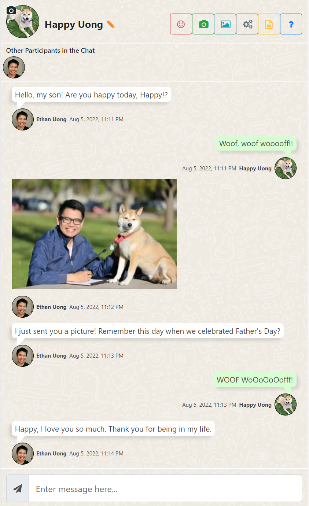

# Chat With Me

> A chatting web app built with React and Socket.io



## Features
Chat With Me with a public chatroom where any participant can send messages, images, emojis, and even selfies! Online communication can help young people build and develop social skills and gives them a platform to share their skills and help each other out.

## Development
- client folder contains frontend related artifacts
  - ```yarn start``` runs the application
  - ```yarn build``` builds the static resources
- server folder contains backend related files
  - ```yarn start``` kicks off the server

## Deployment
- Push server
  - If you host the socket.io server with Heroku, follow the following instruction
  - Heroku Setup
      ```
      npm install -g heroku
      heroku login
      heroku git:remote -a your-app
      git subtree push --prefix server heroku master
      ```
- Push client
  - Use your preference to host your client app. I would suggest to use Netlify as it auto builds for you upon a Git push. Github Pages is another option too but you'll need to configure and manage the Github Actions for automation.
  - Run ```yarn build``` and then deploy.

### Technologies 🔧
+ [React](https://reactjs.org/)
+ [Express](https://expressjs.com/)
+ [Socket.io](https://socket.io/)
+ [Cloudinary](https://cloudinary.com/)

#### License ⚖️
[MIT](https://en.wikipedia.org/wiki/MIT_License)
